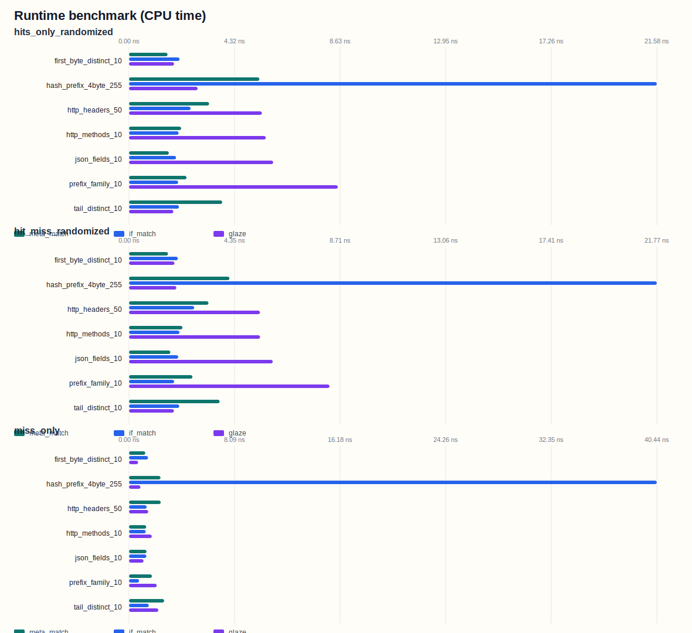
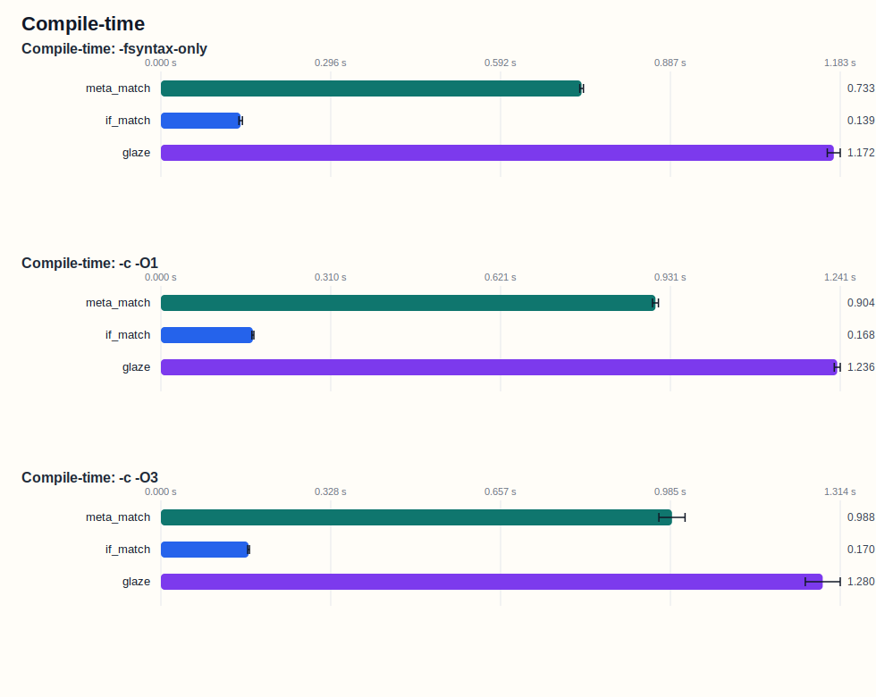

# MetaMatch

`meta_match` is a header-only C++20 string dispatcher for fixed key sets.[^cxx]
It turns declarations such as `make_handler<"help">(...)` into a compile-time
character trie and emits `switch`-based branch code.

The goal is stable low-latency dispatch without a runtime hash table and
without the key-count scaling of a linear `if` chain.

In this repository's benchmark corpus, `meta_match` stays in the low
single-digit nanosecond range across realistic 10-key and 50-key workloads,
wins most realistic cases against `glaze`, and keeps runtime tightly bounded
across favorable, unfavorable, miss-heavy, prefix-sharing, and larger synthetic
datasets. Across all rows in
[`artifacts/bench_report/runtime_summary.json`](artifacts/bench_report/runtime_summary.json),
the worst observed `meta_match` result is `5.65 ns`.

[^cxx]: `meta_match` itself is a C++20 design. The benchmark suite is built as
    C++23 because `glaze`, one of the comparison targets in this setup,
    requires C++23.

## Quick Example

```cpp
#include "meta_match.hh"

using namespace meta_match;

auto handlers = std::tuple{
    make_handler<"help">([] { show_help(); }),
    make_handler<"quit">([] { do_quit(); }),
    make_handler<"version">([] { show_version(); }),
};

bool ok = match(input, handlers);
```

## Why `meta_match`?

Use `meta_match` when the string set is fixed and dispatch latency should stay
predictable across inputs and key distributions.

- Header-only C++20.
- No runtime hash table.
- No generated source file.
- Direct `switch`-based branch code.
- Avoids scanning every registered key.
- Does not rely on a hash layout being favorable to the key set.
- Stable low-nanosecond behavior on the benchmarked realistic datasets.
- Reproducible benchmark artifacts are included in the repository.

## Performance Profile

`meta_match` is optimized for consistency across fixed key sets, not for one
idealized distribution.

A linear matcher can be excellent for tiny key sets, but it accumulates work as
the number of keys grows. A perfect hash can be extremely fast when the key set
maps well to the selected hash strategy, but its result depends on that
construction. `meta_match` takes a different path: it narrows the candidate set
through compile-time trie branches and verifies the final candidate with full
string equality.

In the current benchmark corpus, this produces a strong stability profile:
`meta_match` remains below `5.65 ns` across all rows in
[`artifacts/bench_report/runtime_summary.json`](artifacts/bench_report/runtime_summary.json),
while still winning most realistic small-to-medium hit-path cases.

## Benchmark Highlights

In the current benchmark run:

- On realistic 10-key and 50-key datasets, `meta_match` stays in the low
  single-digit nanosecond range.
- On `json_fields_10`, `meta_match` is faster than both `if_match` and `glaze`
  on hits: `2.22 ns` vs `3.86 ns` vs `7.79 ns`.
- On `http_headers_50`, `meta_match` is faster than both comparison targets on
  hits: `4.40 ns` vs `5.06 ns` vs `7.06 ns`.
- On `tail_distinct_10`, the trie-unfavorable case, `meta_match` is slower than
  the best hash or linear result but still remains at `5.22 ns` on hits.
- On `hash_prefix_4byte_255`, `meta_match` avoids the large linear slowdown of
  `if_match`, while `glaze` wins on raw throughput.
- Across all rows in `runtime_summary.json`, the worst observed runtime is
  `5.65 ns` for `meta_match`, `10.89 ns` for `glaze`, and `55.03 ns` for
  `if_match`.

## Runtime Results

Representative hit-path rows from
[`artifacts/bench_report/runtime_summary.json`](artifacts/bench_report/runtime_summary.json):

| dataset | `meta_match` | `if_match` | `glaze` | interpretation |
|---|---:|---:|---:|---|
| `json_fields_10` | 2.22 ns | 3.86 ns | 7.79 ns | realistic 10-key field dispatch |
| `http_headers_50` | 4.40 ns | 5.06 ns | 7.06 ns | realistic 50-key header dispatch |
| `first_byte_distinct_10` | 2.20 ns | 2.74 ns | 2.53 ns | early split |
| `tail_distinct_10` | 5.22 ns | 3.07 ns | 2.56 ns | late split, trie-unfavorable |
| `hash_prefix_4byte_255` | 5.65 ns | 29.52 ns | 3.26 ns | large hash-friendly set |

The important result is not only which row has the absolute minimum. The
important result is the spread. `meta_match` stays within a narrow
low-nanosecond band across favorable, realistic, and unfavorable cases. The
linear matcher has excellent tiny-set behavior but degrades at 255 keys.
`glaze` has excellent hash-friendly behavior but is slower on several realistic
small-to-medium cases in this corpus.

### Worst Observed Runtime in This Benchmark Summary

The following table is computed across all rows in
[`artifacts/bench_report/runtime_summary.json`](artifacts/bench_report/runtime_summary.json),
using the same row set for all three implementations.

| implementation | worst observed runtime |
|---|---:|
| `meta_match` | 5.65 ns |
| `glaze` | 10.89 ns |
| `if_match` | 55.03 ns |



## Compile-Time Results

`meta_match` is more expensive to compile than a linear fold, but it is
substantially cheaper than `glaze` in the measured compile-time setup. This is
part of the intended trade-off: direct dispatch with stronger runtime scaling
than a linear chain, without paying the full compile-time cost observed for the
hash-based comparison target.

Values below are taken from
[`artifacts/bench_report/compile_summary.json`](artifacts/bench_report/compile_summary.json).

| mode | `meta_match` | `if_match` | `glaze` |
|---|---:|---:|---:|
| `-fsyntax-only` | 1.101 ± 0.009 s | 0.208 ± 0.002 s | 1.802 ± 0.011 s |
| `-c -O1` | 1.372 ± 0.025 s | 0.251 ± 0.008 s | 1.962 ± 0.030 s |
| `-c -O3` | 1.434 ± 0.015 s | 0.256 ± 0.002 s | 1.979 ± 0.156 s |



## Methodology / Reproducibility

Runtime is measured with Google Benchmark. Compile-time is measured with
`hyperfine`.

The benchmark compares three dispatch strategies over the same key sets and
runtime input sequences.

### `meta_match`

`meta_match` takes the complete key set as a compile-time tuple of handlers. At
compile time, those keys are represented as a character trie. The runtime path
is then emitted as direct `switch`-based branch code rather than as a runtime
trie object or hash table.

Operationally, the dispatch path works in three stages:

1. At depth `N`, inspect the runtime byte at position `N`.
2. Narrow the candidate set to only the keys that still match at that depth.
3. If one candidate remains, verify the full string and invoke its handler; if
   several remain, recurse to the next depth with the reduced candidate set.

This means that the trie exists in the type and constexpr layer during
compilation, while the runtime artifact is ordinary branch code plus one final
string equality check on the selected candidate. Duplicate keys are rejected at
compile time when the corresponding terminal trie state is instantiated.

The benchmark implementation also accepts arbitrary `std::string_view` inputs,
including non-null-terminated buffers and prefix-sharing key families.

### `if_match`

`if_match` is the linear baseline. It checks the input string against the
registered keys through a short-circuit chain of equality comparisons and
invokes the first matching handler.

This approach is important because it is simple, cheap to compile, and often
surprisingly strong at very small key counts. Modern compilers can make
individual equality checks inexpensive. The trade-off is accumulation: the
number of candidate checks still grows with the size of the registered key set.

### `glaze`

`glaze` is the hash-based comparison target. In this setup it uses a
compile-time perfect-hash-style approach that searches for a mapping from keys
to unique indices and dispatches through that index.

The important point for this README is not the internal mechanics of that
search, but the resulting trade-off. When the key set is favorable to the
selected construction, the measured runtime can be excellent. The comparison is
therefore not trie versus a weak baseline; it is trie dispatch against a strong
static-dispatch strategy with different strengths.

### Runtime Workload

Runtime measurements are taken with Google Benchmark over precomputed input
sequences. For each dataset, the benchmark builds three workload modes:

- hits only: successful lookups only, in randomized order
- hit/miss mixed: a mixture of successful and unsuccessful lookups
- misses only: unsuccessful lookups only

The benchmark driver feeds the same sequence shape to each implementation for a
given dataset and mode. This keeps the comparison aligned across
`meta_match`, `if_match`, and `glaze`.

The current runtime corpus includes:

- `http_methods_10`
- `json_fields_10`
- `first_byte_distinct_10`
- `tail_distinct_10`
- `http_headers_50`
- `hash_prefix_4byte_255`
- `prefix_family_10`

These datasets are intentionally mixed. Some are realistic protocol or schema
tables, some are favorable to early trie separation, some are unfavorable, and
some are synthetic scale tests.

### Compile-Time Workload

Compile-time is measured with `hyperfine`, with each implementation built in
isolation through a dedicated translation unit:

Each compile-time comparison is built in isolation through:

- `_ct_meta.cc`
- `_ct_if.cc`
- `_ct_glaze.cc`

Those compile-time drivers use the key set `"00"` through `"99"`, so the
compiler always sees exactly 100 keys. The reported compile-time modes cover
frontend-only work (`-fsyntax-only`) as well as object generation (`-c -O1` and
`-c -O3`).

This split matters for interpretation. It shows not only whether one approach
is expensive in a fully optimized build, but also whether the template and
constexpr front-end cost already differs before code generation is included.

### Reproducing the Results

To reproduce the results:

```sh
nix develop
make
make bench
make compile-time
make bench-report
```

Important generated artifacts:

```text
artifacts/bench_report/runtime_summary.json
artifacts/bench_report/compile_summary.json
artifacts/bench_report/runtime_benchmark.svg
artifacts/bench_report/compile_time.svg
```

## Discussion

### Stable Latency Is the Main Result

The benchmark suite includes favorable, unfavorable, realistic, miss-heavy,
prefix-sharing, and larger synthetic key sets. Across that spread,
`meta_match` remains in a narrow runtime band. That is the central design
result: the trie avoids the key-count accumulation of a linear chain and does
not depend on finding a particularly good hash layout.

### Realistic Small-to-Medium Sets Are the Target

The realistic 10-key and 50-key datasets are where the library is positioned.
In this corpus, `meta_match` wins the representative `json_fields_10` and
`http_headers_50` hit-path rows against both baselines, and remains comfortably
in low single-digit nanoseconds.

### Worst-Case Behavior Matters

Peak best-case numbers are only part of the story. Across the full
`runtime_summary.json` row set, `meta_match` has the strongest worst observed
runtime of the three measured implementations: `5.65 ns`, versus `10.89 ns`
for `glaze` and `55.03 ns` for `if_match`. In this repository, the main value
of the trie is not just that it can win particular rows; it is that it keeps
dispatch tightly bounded across many different rows.

### Perfect Hashing Is a Strong Baseline, Not the Whole Story

The large synthetic hash-friendly dataset is a good demonstration of where
perfect hashing should do well. It is useful evidence, but it should not be the
only lens for evaluating static string dispatch. The realistic 10-key and
50-key datasets show a different shape, where `meta_match` is consistently
competitive and often faster.

### Linear Matching Is a Good Tiny-Set Baseline, but It Scales Linearly

The linear matcher is a serious baseline for tiny sets. The compiler can make
individual string checks cheap. The issue is accumulation: as the key count
grows, the chain still has more candidates to reject. The 255-key dataset makes
that cost visible directly.

## Limitations

The benchmark results are measurements of this repository's corpus, compiler,
flags, and machine. They should not be read as architecture-independent
absolute numbers.

`meta_match` is designed for fixed key sets known at compile time. It is not a
dynamic registry and does not replace runtime maps when keys are added at
runtime.

Perfect hashing remains a strong choice for large hash-friendly distributions.
The point of `meta_match` is not to beat every perfect hash on every possible
key set; it is to provide consistently fast direct dispatch across ordinary
static key sets with simple integration and reproducible behavior.
